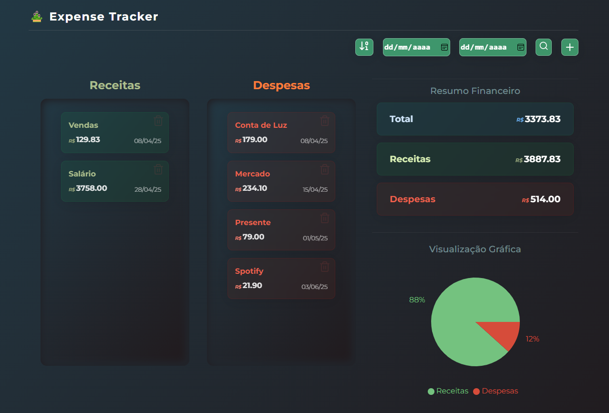
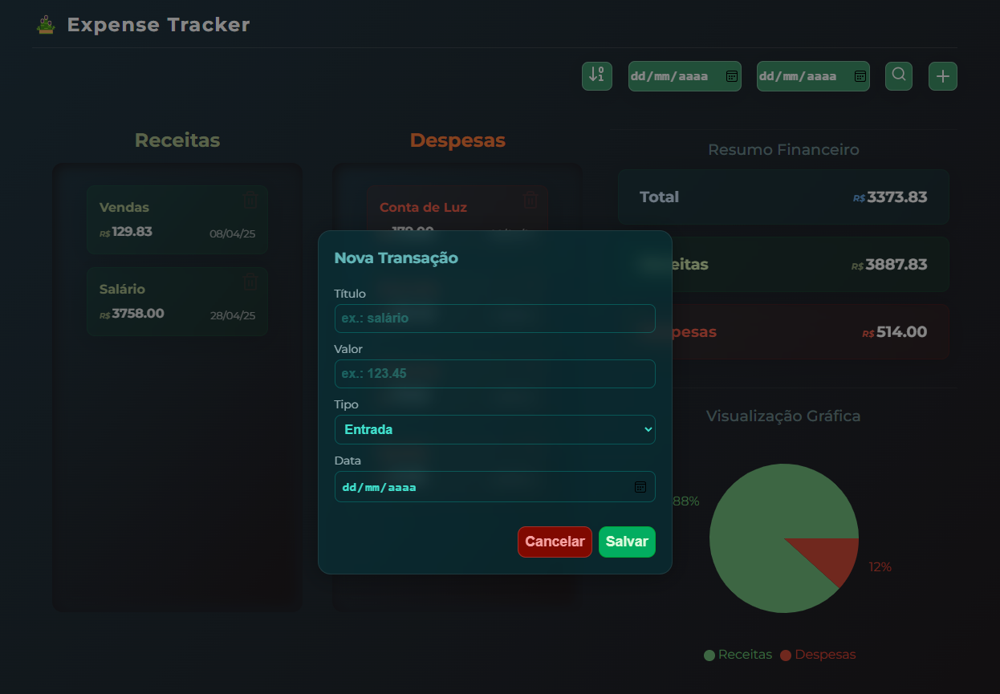
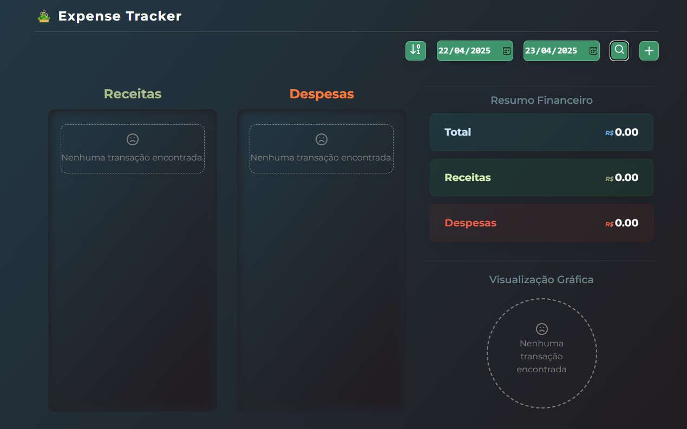

# Rastreador de Gastos Pessoais
Este projeto é um gerenciador de finanças pessoais, construído para ser intuitivo, útil e de fácil  utilização para facilitar a adesão de controles financeiros na vida da população, reduzindo as barreiras de entrada para que o consumidor final possa gerenciar com conforto suas receitas e despesas ao final de cada dia ou semana.

### Detalhes Técnicos
Este projeto é um frontend construído em React.js, focado em consumir uma API de autoria própria [(disponível aqui)](https://github.com/Ale015/backend-expense-tracker), que conecta-se a um banco PostgreSQL para consumir os dados armazenados. O intuito principal desta aplicação foi o aperfeiçoamento de conhecimentos e aplicações práticas dos mesmos.

## Principais Recursos do Projeto
- Adição de Transações
- Filtros de Datas
- Ordenação por Data (crescente ou decrescente)
- Exclusão dos Cards
- Gráfico e Cálculos para visualização geral

## Tecnologias Usadas:
- React.JS
- HTML, CSS e JavaScript
- Yarn e Vite
- Lucide

---

## Preview do Projeto

## Como Rodar

1. **Clonar o Repositório**
    
    `git clone <url do projeto>`

2. **Iniciar o [Backend](https://github.com/Ale015/backend-expense-tracker)**

3. **Navegar até o projeto**
    
    `cd <repositório local>`

4. **Instalar as dependências**
    `npm install`

5. **Rodar a Aplicação**

    `npm run dev`

6. **Acessar a porta disponibilizada.**
    > Geralmente a porta 5173 (*vite*)